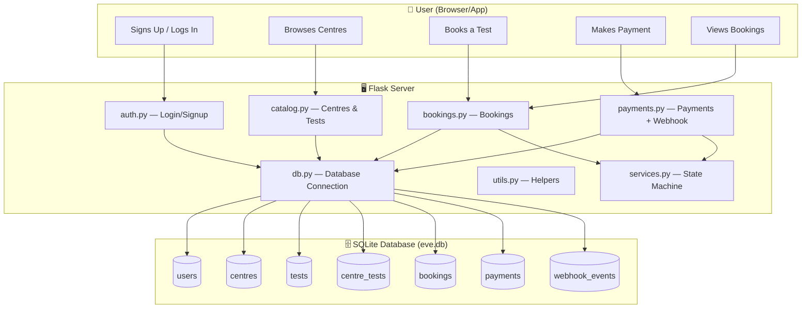
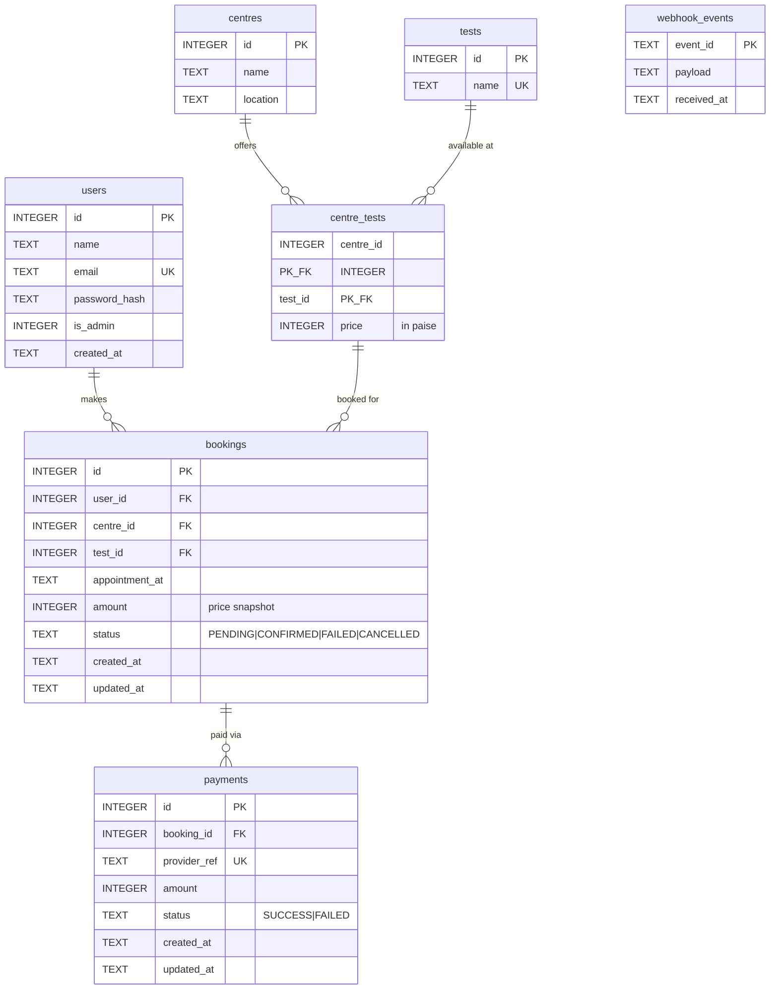
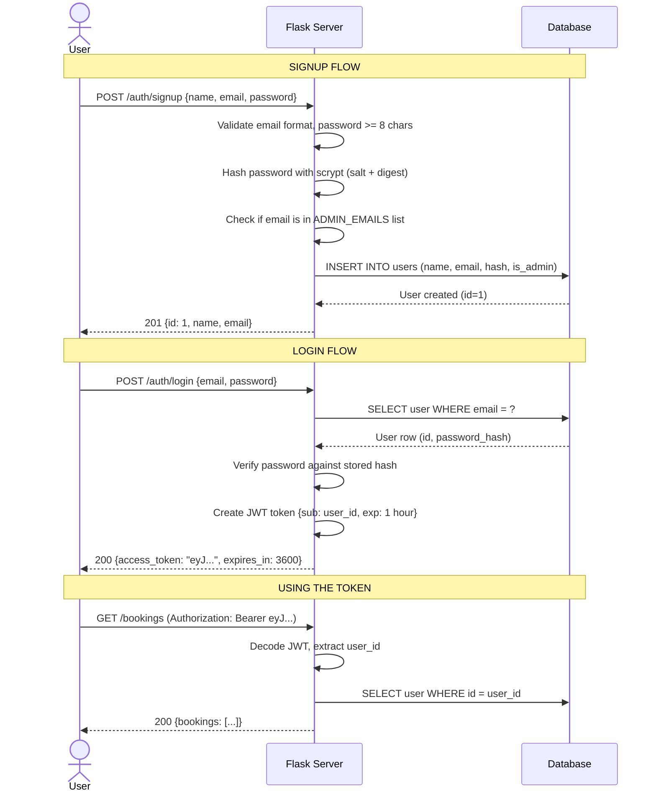
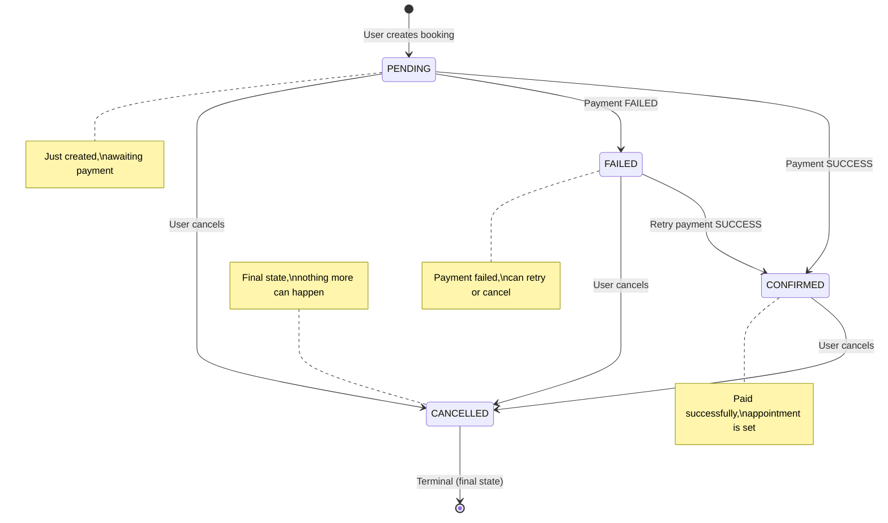
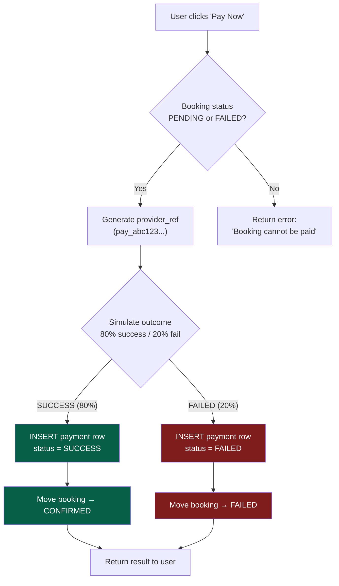
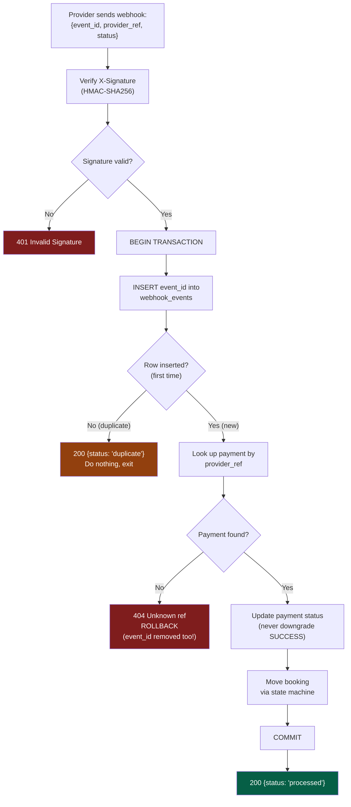
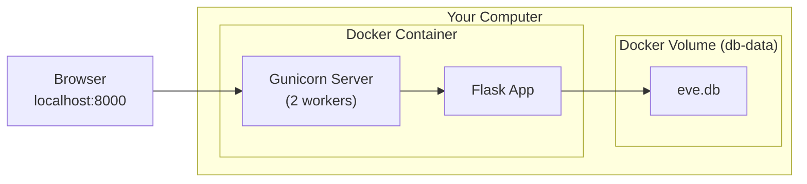
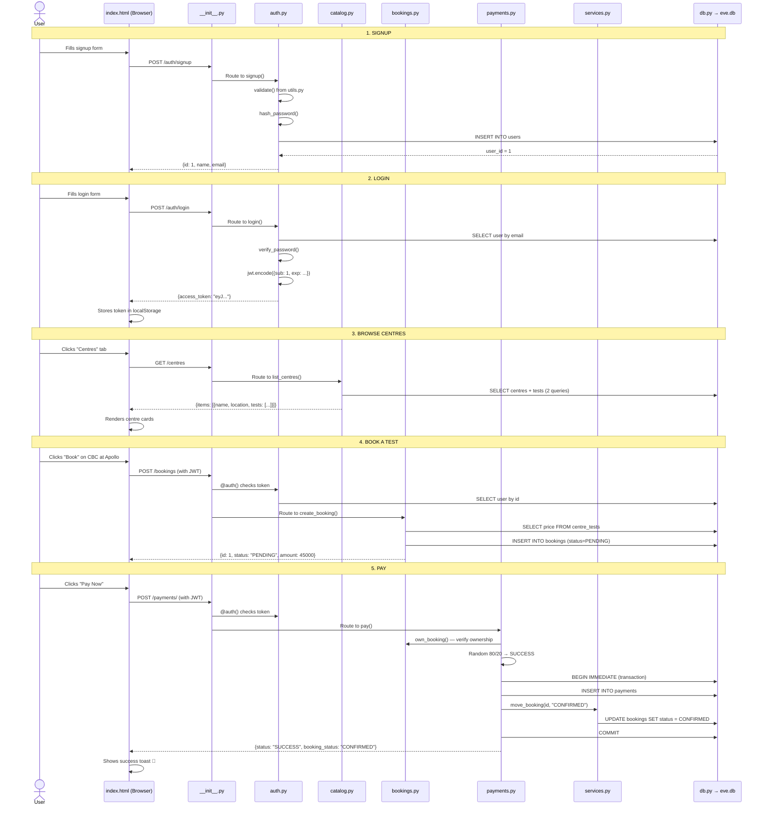

# 🩺 EVE Healthcare — Diagnostic Bookings API

## A Complete Guide (Explained Simply)

> **Think of this project like Practo or 1mg**, but just the backend (the engine behind the scenes).
> Users can **sign up**, **browse diagnostic centres**, **book a blood test or scan**, **pay for it**, and **track their bookings** — all through a web interface + API.

---

## 📖 Table of Contents

1. [What Does This Project Do?](#-what-does-this-project-do)
2. [The Big Picture — How Everything Connects](#-the-big-picture--how-everything-connects)
3. [Folder Structure — What Each File Does](#-folder-structure--what-each-file-does)
4. [Database Design — How Data is Stored](#-database-design--how-data-is-stored)
5. [How Authentication Works (Login/Signup)](#-how-authentication-works-loginsignup)
6. [How Booking Works — The State Machine](#-how-booking-works--the-state-machine)
7. [How Payments Work](#-how-payments-work)
8. [How the Webhook Works (Idempotency)](#-how-the-webhook-works-idempotency)
9. [API Endpoints — The Complete List](#-api-endpoints--the-complete-list)
10. [Code Walkthrough — File by File](#-code-walkthrough--file-by-file)
11. [How Docker Works](#-how-docker-works)
12. [How the Tests Work](#-how-the-tests-work)
13. [The Web UI (Frontend)](#-the-web-ui-frontend)
14. [How to Run the Project](#-how-to-run-the-project)
15. [Glossary — Technical Terms Explained](#-glossary--technical-terms-explained)

---

## 🎯 What Does This Project Do?

Imagine you want to get a **blood test** done. Here's what happens:

1. You **create an account** (signup) and **login** to get a pass (JWT token)
2. You **browse diagnostic centres** — e.g., "Apollo Diagnostics, Mumbai" has CBC for ₹450
3. You **book an appointment** — pick a centre, test, date & time
4. You **pay** for the booking — the system simulates a payment gateway (80% success, 20% fail)
5. If payment succeeds → booking is **CONFIRMED**. If it fails → **FAILED** (you can retry)
6. You can **cancel** at any time
7. An **admin** can add new centres, add tests, change prices, and see system-wide stats

### Tech Stack (What Tools Are Used)

| Tool | What It Does | Analogy |
|------|-------------|---------|
| **Python** | The programming language | The language you write your essay in |
| **Flask** | Web framework — handles HTTP requests | The post office that routes your letters |
| **SQLite** | Database — stores all data in a single file | Your notebook where you write everything down |
| **PyJWT** | Creates login tokens | Your school ID card — proves who you are |
| **Gunicorn** | Production server — runs Flask for real users | The school bus vs. walking (faster, more reliable) |
| **Docker** | Packages everything into a container | A lunchbox — everything needed in one box |

---

## 🏗 The Big Picture — How Everything Connects



### In Simple Words:
- The **user** talks to the **Flask server** via HTTP requests (like typing a URL in a browser)
- The **Flask server** has different "departments" — auth handles login, catalog handles centres, etc.
- Every department reads/writes data to the **SQLite database** (a single file called `eve.db`)

---

## 📂 Folder Structure — What Each File Does

```
eve-bookings/
├── app/                      👈 THE MAIN APPLICATION CODE
│   ├── __init__.py           👈 App factory — builds and configures the Flask app
│   ├── schema.sql            👈 Database blueprint — defines all tables
│   ├── db.py                 👈 Database connection + seed data
│   ├── utils.py              👈 Shared helpers — validation, pagination, errors, time
│   ├── auth.py               👈 Signup, Login, JWT tokens, @auth() decorator
│   ├── catalog.py            👈 Centres & tests — CRUD operations + admin stats
│   ├── services.py           👈 Booking state machine — controls status transitions
│   ├── bookings.py           👈 Create, list, view, cancel bookings
│   ├── payments.py           👈 Payment simulation + webhook handler
│   └── static/               👈 Web UI files (HTML, CSS, JS)
│       ├── index.html        👈 The full web interface
│       ├── swagger.html      👈 Swagger API documentation UI
│       └── openapi.yaml      👈 API specification (machine-readable)
├── tests/
│   └── test_api.py           👈 17 automated tests
├── requirements.txt          👈 Python libraries needed (Flask, PyJWT, gunicorn)
├── Dockerfile                👈 Instructions to build a Docker image
├── docker-compose.yml        👈 One-command Docker setup
├── .gitignore                👈 Files Git should ignore
└── README.md                 👈 Original project documentation
```

### What each file is responsible for (Think of it like school departments):

| File | Department | What It Handles |
|------|-----------|----------------|
| `__init__.py` | **Principal's Office** | Sets up the entire school — registers all departments, handles errors |
| `schema.sql` | **School Blueprint** | Floor plan — defines what rooms (tables) exist and their rules |
| `db.py` | **Record Room** | Opens/closes the records, creates tables, seeds demo data |
| `utils.py` | **Stationery Cupboard** | Shared tools everyone uses — validation, pagination, timestamps |
| `auth.py` | **ID Card Counter** | Issues ID cards (JWT tokens), checks them at the gate |
| `catalog.py` | **Notice Board** | Lists which centres exist and what tests they offer |
| `services.py` | **Rules Committee** | Decides which booking status changes are allowed |
| `bookings.py` | **Appointment Desk** | Creates appointments, lists them, cancels them |
| `payments.py` | **Fee Counter** | Takes payments, talks to the "payment gateway" |
| `test_api.py` | **Exam Hall** | Tests everything works correctly (17 different exams) |

---

## 🗄 Database Design — How Data is Stored

### ER Diagram (Entity Relationship)



### Tables Explained Simply

#### 1. `users` — Who is using the app?
Like a school register. Stores name, email, hashed password (never the real password!), and whether they're an admin.

#### 2. `centres` — Where can you get tested?
A list of diagnostic centres. Example: "Apollo Diagnostics" in "Mumbai".

#### 3. `tests` — What tests exist?
A master list of test types. Example: "Complete Blood Count", "Lipid Profile", etc.

#### 4. `centre_tests` — Which centre offers which test, and at what price?
This is the **junction table** (many-to-many). Think of it like a price list:
- Apollo (centre 3) offers CBC (test 1) at ₹450 (45000 paise)
- Apollo (centre 3) also offers Lipid Profile (test 2) at ₹850

> **Why "paise" instead of rupees?**
> Storing money as integers (paise) avoids floating-point errors. ₹350.00 = 35000 paise.
> Try `0.1 + 0.2` in any calculator — you get `0.30000000000000004`. With integers, `10 + 20 = 30`. No errors!

#### 5. `bookings` — Who booked what?
Records every appointment. The `amount` is a **snapshot** of the price at booking time — so if the admin changes the price later, your booking amount doesn't change.

The `status` field is a state machine (explained below).

#### 6. `payments` — Money records
Each payment attempt is logged. `provider_ref` is like a receipt number (`pay_abc123...`). A booking can have multiple payment attempts (if the first one fails, you retry).

#### 7. `webhook_events` — Duplicate protection ledger
When the payment "provider" sends us an update, we store the `event_id` here. If the same event comes again, we say "already processed" and don't do anything — this prevents double-processing.

### Smart Database Rules (Constraints)

The database itself enforces safety rules — even if the code has a bug, the database won't allow bad data:

| Rule | What It Prevents | How It Works |
|------|-----------------|-------------|
| `uq_active_slot` | Double-booking the same slot | Unique index on (user, centre, test, time) for PENDING/CONFIRMED bookings |
| `uq_one_success_per_booking` | Paying twice for the same booking | Unique index on (booking_id) where payment status = SUCCESS |
| `CHECK (price > 0)` | Negative prices | Database rejects INSERT if price ≤ 0 |
| `CHECK (status IN (...))` | Invalid statuses | Only allows PENDING/CONFIRMED/FAILED/CANCELLED |
| `FOREIGN KEY (centre_id, test_id) REFERENCES centre_tests` | Booking a test the centre doesn't offer | Composite foreign key checks both together |

---

## 🔐 How Authentication Works (Login/Signup)



### Key Concepts:

**Password Hashing** — The server NEVER stores your actual password. It runs your password through a one-way mathematical function called `scrypt`. Think of it like a meat grinder — you can put meat in and get keema out, but you can't turn keema back into meat.

```
"password123"  →  scrypt  →  "a3f8c2...long random string..."
```

**JWT Token** — After login, the server gives you a "pass" (JSON Web Token). It's a long string that contains:
- **Who you are** (user_id)
- **When it expires** (1 hour from now)
- **A signature** (proves it wasn't tampered with)

Think of it like a cinema ticket — it has your seat number, show time, and a barcode the scanner checks.

**The `@auth()` decorator** — This is like a security guard. Any function decorated with `@auth()` checks your token before letting you in. `@auth(admin=True)` also checks if you're an admin.

---

## 🔄 How Booking Works — The State Machine

A booking goes through different "states" (like an order on Amazon):



### The Rules (defined in `services.py`):

| Target Status | Can Come From | Example |
|--------------|--------------|---------|
| CONFIRMED | PENDING, FAILED | Payment succeeded |
| FAILED | PENDING, FAILED | Payment failed (yes, FAILED→FAILED is allowed for retries) |
| CANCELLED | PENDING, FAILED, CONFIRMED | User cancelled at any point |

### How `move_booking()` Works — Race-Free Updates

```python
# Instead of: read status, check if allowed, then update (TWO steps = race condition)
# We do it in ONE atomic SQL statement:

UPDATE bookings
SET status = 'CONFIRMED', updated_at = '2026-...'
WHERE id = 42
  AND status IN ('PENDING', 'FAILED')   -- only moves if current status allows it
```

**Why is this important?** Imagine two requests arrive at the same time — one trying to confirm, one trying to cancel. With read-then-write (two steps), both might read "PENDING" and both succeed. With one atomic UPDATE, only one wins. The other's `WHERE` clause won't match, so `rowcount = 0` and nothing happens.

---

## 💳 How Payments Work



### Important Details:

- **Provider Ref** — A unique ID like `pay_a1b2c3d4e5f6g7h8`. In a real system, this would come from Razorpay/Stripe. Here it's generated with `uuid4`.
- **Simulate parameter** — For testing/demos, you can force the outcome: `{"booking_id": 1, "simulate": "SUCCESS"}`. Without it, there's an 80/20 random chance.
- **Transaction** — The payment INSERT and booking status UPDATE happen inside a `tx()` (transaction). Either BOTH succeed or BOTH rollback. You never get a payment recorded without the booking status changing.
- **Retry** — If payment fails, the booking becomes FAILED but you can try again. Each attempt creates a new payment row.
- **One Success Rule** — The database has a unique index: only ONE successful payment per booking. Even if there's a code bug, the DB won't allow it.

---

## 🔔 How the Webhook Works (Idempotency)

### What Is a Webhook?

In real life, when you pay on Razorpay, the payment takes a few seconds. Razorpay processes it, then **calls back** your server to say "hey, payment xyz succeeded/failed." This callback is a **webhook**.

### What Is Idempotency?

It means: **doing something twice has the same effect as doing it once**.

Example: Pressing the elevator button 5 times doesn't call 5 elevators. The first press works, the rest are ignored.

Why is this needed? The payment provider might send the same webhook **multiple times** (network issues, retries). We must NOT process it twice (or the user gets charged twice, or the booking status flips back and forth).



### The Clever Part:

1. **Signature Check** — The provider signs the request body with a shared secret. We recalculate and compare. If someone fakes a webhook, the signature won't match → 401.

2. **Event ID as Primary Key** — We `INSERT INTO webhook_events ... ON CONFLICT DO NOTHING`. If the row already exists (duplicate), `rowcount = 0` → we return "duplicate" immediately.

3. **Rollback on Error** — If we insert the event_id but then fail (e.g., unknown provider_ref), the whole transaction rolls back — **including the event_id row**. So the provider can retry later and it'll work.

4. **Never Downgrade** — A SUCCESS payment never becomes FAILED. The SQL says `WHERE status != 'SUCCESS'`. And a CONFIRMED booking won't go back to FAILED (the state machine prevents it).

---

## 📡 API Endpoints — The Complete List

> **Base URL**: `http://localhost:8000`
> **Money**: Integer paise (50000 = ₹500.00)
> **Times**: UTC ISO-8601 (e.g., `2027-01-15T10:30:00Z`)
> **Errors**: Always `{"error": {"code": "...", "message": "..."}}`
> **Pagination**: `?page=1&page_size=20` (max 100)

### Public Endpoints (No Login Required)

| Method | Path | What It Does |
|--------|------|-------------|
| `POST` | `/auth/signup` | Create an account. Body: `{name, email, password}` |
| `POST` | `/auth/login` | Login. Returns `{access_token, token_type, expires_in}` |
| `GET` | `/centres` | List all centres with their tests and prices |
| `GET` | `/centres/:id` | Get one specific centre |
| `GET` | `/health` | Server health check → `{status: "ok"}` |

### User Endpoints (Need JWT Token)

| Method | Path | What It Does |
|--------|------|-------------|
| `POST` | `/bookings` | Book a test. Body: `{centre_id, test_id, appointment_at}` |
| `GET` | `/bookings` | List my bookings (newest first) |
| `GET` | `/bookings/:id` | Get booking details + payment history |
| `POST` | `/bookings/:id/cancel` | Cancel a booking |
| `POST` | `/payments/` | Pay for a booking. Body: `{booking_id, simulate?}` |

### Admin Endpoints (Need Admin JWT Token)

| Method | Path | What It Does |
|--------|------|-------------|
| `POST` | `/centres` | Create a new centre. Body: `{name, location}` |
| `POST` | `/centres/:id/tests` | Add/update a test at a centre. Body: `{name, price}` |
| `DELETE` | `/centres/:id/tests/:tid` | Remove a test from a centre |
| `GET` | `/admin/stats` | System-wide dashboard stats |

### Webhook (HMAC Signature Required)

| Method | Path | What It Does |
|--------|------|-------------|
| `POST` | `/payments/webhook` | Provider callback. Body: `{event_id, provider_ref, status}` |

---

## 🔍 Code Walkthrough — File by File

### 1. `app/__init__.py` — The App Factory

**What**: Creates and configures the Flask application.

**Key things it does**:
- Sets up configuration from environment variables (database path, secrets, admin emails)
- Initializes the database (creates tables if they don't exist)
- Registers all "blueprints" (auth, catalog, bookings, payments, admin)
- Sets up error handlers — every error returns consistent JSON
- Adds the `/health`, `/` (UI), and `/docs/swagger` routes

**The pattern is called "Application Factory"** — instead of having one global app, we have a function `create_app()` that builds a new app. This makes testing easier (each test gets a fresh app).

```python
def create_app(config=None):
    app = Flask(__name__)
    # ... configure, register blueprints, add routes
    return app
```

---

### 2. `app/schema.sql` — The Database Blueprint

**What**: SQL statements that create all 7 tables.

This file is read once when the app starts. `CREATE TABLE IF NOT EXISTS` means it won't crash if tables already exist.

**Think of it like a building blueprint** — it defines all the rooms (tables), doors (foreign keys), and safety locks (constraints/indexes) before anyone moves in.

---

### 3. `app/db.py` — Database Connection & Seed Data

**What**: Manages the SQLite connection lifecycle and seeds demo data.

**Key functions**:

| Function | What It Does |
|----------|-------------|
| `get_db()` | Opens a database connection for the current request. Stored in Flask's `g` object (per-request storage). Returns the same connection if called multiple times in one request. |
| `close_db()` | Closes the connection when the request ends. Flask calls this automatically. |
| `init_db(path)` | Creates the database file and runs `schema.sql` to create tables. Also enables WAL mode (readers don't block writers). |
| `seed(path)` | Inserts demo data: 5 centres, 10 tests, with realistic pricing. Safe to run repeatedly — checks if data exists first. |

**Connection settings**:
- `isolation_level=None` — autocommit mode (each SQL runs immediately). For multi-statement writes, we explicitly use transactions via `utils.tx()`.
- `row_factory = sqlite3.Row` — results come back as dict-like objects instead of plain tuples. So you can write `row["name"]` instead of `row[1]`.
- `PRAGMA foreign_keys = ON` — enables foreign key enforcement (SQLite has it off by default!).
- `PRAGMA journal_mode = WAL` — Write-Ahead Logging. Multiple readers can read while one writer writes. Better concurrency.

---

### 4. `app/utils.py` — Shared Helpers

**What**: Small tools used by all other files.

#### `ApiError` — Custom Exception
```python
raise ApiError(400, "validation_error", "'email' is not valid")
# Becomes: HTTP 400 {"error": {"code": "validation_error", "message": "'email' is not valid"}}
```
The app factory has an error handler that catches `ApiError` and turns it into JSON.

#### `validate(data, required, optional)` — Input Validation
Checks that the request body is a JSON object with the right fields and types:
```python
d = validate(request.get_json(), {"name": str, "price": int})
# If "name" is missing or "price" is a string → raises ApiError
```

#### `page_params(args)` — Pagination
Parses `?page=2&page_size=10` → returns `(page=2, size=10, offset=10)`.
Offset is used in SQL: `LIMIT 10 OFFSET 10` (skip first 10, show next 10).

#### `now()` — Current UTC Time
Returns current time as ISO-8601 string: `"2026-10-01T15:30:00+00:00"`

#### `tx(db)` — Transaction Manager
Wraps multiple SQL statements in one atomic transaction:
```python
with tx(db):
    db.execute("INSERT ...")   # step 1
    db.execute("UPDATE ...")   # step 2
    # If step 2 fails, step 1 is also rolled back
```
Uses `BEGIN IMMEDIATE` to take the write lock upfront — prevents deadlocks.

---

### 5. `app/auth.py` — Authentication

**What**: Handles signup, login, and the `@auth()` security decorator.

#### Password Hashing (`hash_password` / `verify_password`)
```
password123 + random_salt → scrypt → "salt_hex$digest_hex"
```
- **scrypt** is a memory-hard hashing algorithm — very slow to brute-force
- A random **salt** (16 bytes) is generated for each user — so two users with the same password get different hashes
- Verification uses `hmac.compare_digest` for **constant-time comparison** — prevents timing attacks

#### The `@auth()` Decorator
```python
@bp.get("/bookings")
@auth()         # ← This checks the JWT token before the function runs
def list_bookings():
    # g.user is now available with the logged-in user's info
    ...
```

Think of it like a **bouncer at a club**:
1. Check if you have a wristband (Authorization header)
2. Check if the wristband is valid (decode JWT, check expiry)
3. Check if you still exist in the system (database lookup)
4. If `admin=True`, also check the `is_admin` flag

---

### 6. `app/catalog.py` — Centres & Tests

**What**: CRUD for diagnostic centres and their test offerings.

**Key functions**:

| Function | What It Does |
|----------|-------------|
| `list_centres()` | GET /centres — returns paginated list with tests attached |
| `get_centre()` | GET /centres/:id — returns one centre |
| `create_centre()` | POST /centres — admin creates a new centre |
| `add_test()` | POST /centres/:id/tests — admin adds/updates a test at a centre |
| `remove_test()` | DELETE /centres/:id/tests/:tid — admin removes a test |
| `admin_stats()` | GET /admin/stats — full system dashboard |

**The `_with_tests()` helper** solves the **N+1 query problem**:

> **Bad**: 1 query for centres + N queries for tests (one per centre) = 11 queries for 10 centres
> **Good**: 1 query for centres + 1 query for ALL tests at once = 2 queries, always

```python
# ONE query gets all tests for all centres at once
SELECT ct.centre_id, t.id, t.name, ct.price
FROM centre_tests ct JOIN tests t ON t.id = ct.test_id
WHERE ct.centre_id IN (1, 2, 3, 4, 5)
```

---

### 7. `app/services.py` — The State Machine

**What**: The single source of truth for booking status transitions.

This is the **smallest but most important file** (25 lines). It defines:
- Which transitions are allowed
- How to atomically move a booking's status

```python
ALLOWED_FROM = {
    "CONFIRMED": ("PENDING", "FAILED"),      # only PENDING/FAILED can become CONFIRMED
    "FAILED":    ("PENDING", "FAILED"),       # same
    "CANCELLED": ("PENDING", "FAILED", "CONFIRMED"),  # anything non-final → CANCELLED
}
```

Both `payments.py` and `bookings.py` (cancel) call `move_booking()`. There's no direct status assignment like `booking.status = "CONFIRMED"` — every transition goes through this gatekeeper.

---

### 8. `app/bookings.py` — Booking Management

**What**: Create, list, view, and cancel bookings.

**Key rules**:
- `own_booking()` — returns 404 (not 403) for other users' bookings. This prevents **enumeration attacks** (trying booking IDs 1, 2, 3... to see who booked what).
- `_future_utc()` — validates that the appointment date is valid ISO-8601 AND in the future.
- `create_booking()` — looks up the current price from `centre_tests` and snapshots it as `amount`.

---

### 9. `app/payments.py` — Payments & Webhook

**What**: Handles the mock payment flow and the provider webhook.

This is the most complex file. Two endpoints:

1. **`POST /payments/`** — User pays for a booking
   - Checks booking is PENDING or FAILED
   - Simulates outcome (random or forced via `simulate` parameter)
   - In ONE transaction: inserts payment row + moves booking status

2. **`POST /payments/webhook`** — Provider sends status update
   - Verifies HMAC signature
   - Deduplicates using `event_id` (the idempotency mechanism)
   - Updates payment and booking status

---

### 10. `tests/test_api.py` — The Test Suite

**What**: 17 automated tests that verify everything works correctly.

Each test:
1. Creates a fresh temporary database
2. Sets up an admin, a regular user, and another user
3. Creates a centre with one test
4. Runs the test scenario
5. Deletes the temporary database

**Tests are grouped by feature**:

| Test | What It Verifies |
|------|-----------------|
| `test_signup_validation_and_duplicates` | Bad emails, short passwords, duplicate signups |
| `test_login_and_token_checks` | Wrong password, missing/invalid tokens |
| `test_catalog_admin_only_write_public_read` | Non-admins can't create centres, public can read |
| `test_price_update_and_bad_price` | Re-posting updates price, negative prices rejected |
| `test_create_booking_and_edge_cases` | Past dates, non-ISO dates, non-existent tests |
| `test_bookings_are_private` | Other users get 404, not 403 |
| `test_cancel` | Cancel works, double-cancel fails, slot frees up |
| `test_payment_success_confirms_booking` | Pay → CONFIRMED, no double payment |
| `test_failed_payment_then_retry` | FAILED → retry → SUCCESS works |
| `test_webhook_rejects_bad_signature` | Wrong secret → 401 |
| `test_webhook_is_idempotent` | Same event 3 times = only processed once |
| `test_replayed_event_id_cannot_flip_state` | Duplicate event_id with different body = still duplicate |
| `test_late_failure_event_never_downgrades` | SUCCESS payment can't be downgraded to FAILED |
| `test_success_event_for_cancelled_booking` | Cancelled stays cancelled even if payment succeeds |
| `test_unknown_payment_ref` | Unknown ref = 404, and event_id is rolled back |
| `test_second_success_for_same_booking` | Two successful payments for one booking = 409 |

---

## 🐳 How Docker Works



### Dockerfile (step by step)
```dockerfile
FROM python:3.12-slim          # Start with a lightweight Python image
WORKDIR /srv                   # Create and enter /srv directory
COPY requirements.txt .        # Copy requirements first (for caching)
RUN pip install ... -r ...     # Install Flask, PyJWT, gunicorn
COPY app app                   # Copy your code
ENV DATABASE=/data/eve.db      # Database goes in /data (which is a volume)
VOLUME /data                   # Declare /data as a persistent volume
EXPOSE 8000                    # Tell Docker we use port 8000
CMD ["gunicorn", ...]          # Start the production server
```

### docker-compose.yml
```yaml
services:
  api:
    build: .                   # Build image from Dockerfile
    ports: ["8000:8000"]       # Map port 8000 inside container to 8000 on your machine
    environment:
      SECRET_KEY: change-me    # Used to sign JWT tokens
      WEBHOOK_SECRET: change-me-too  # Used to verify webhooks
      ADMIN_EMAILS: admin@example.com  # These emails become admins on signup
    volumes: [db-data:/data]   # Persist database across container restarts
volumes:
  db-data:                     # Named volume for the SQLite database
```

**Why Docker?** Without Docker, you need to install Python, create a venv, install packages, set env vars... With Docker: `docker compose up --build` and it all works. Same on every computer.

**Why a Volume?** If you restart the container, everything inside it is lost. A volume saves the database file outside the container, so your data survives restarts.

---

## 🌐 The Web UI (Frontend)

The frontend is a **single HTML file** (`app/static/index.html`) with inline CSS and JavaScript. It's a **Single Page Application (SPA)** — the page never fully reloads; different sections show/hide.

### Pages:

| Page | What It Shows |
|------|-------------|
| **Home** | Hero section with animated gradient orbs, live stats |
| **Centres** | All 5 centres with searchable test cards + "Book" buttons |
| **My Bookings** | Your bookings with status badges, "Pay Now" and "Cancel" actions |
| **Admin** | (Admin only) System stats, add centres/tests, recent activity table |
| **API Docs** | Endpoint reference table + link to Swagger UI |

### How It Works:
```
User clicks "Book" → JavaScript calls fetch('/bookings', POST) → Flask processes → returns JSON → JavaScript updates the page
```

No page reload. It's all `fetch()` calls (AJAX).

---

## 🚀 How to Run the Project

### Option A: Docker (Recommended)
```bash
docker compose up --build       # Build image + start container
docker compose exec api flask --app app seed   # Load demo data
# Open http://localhost:8000
```

### Option B: Local Python
```bash
python -m venv .venv && source .venv/bin/activate   # Windows: .venv\Scripts\activate
pip install -r requirements.txt
export ADMIN_EMAILS=admin@example.com               # Windows: set ADMIN_EMAILS=admin@example.com
flask --app app seed                                # Load demo data
flask --app app run                                 # Start dev server at http://127.0.0.1:5000
```

### Admin Access
Sign up with email **`admin@example.com`** (password of your choice, min 8 chars). This email is configured in `docker-compose.yml` under `ADMIN_EMAILS`.

### Running Tests
```bash
python -m unittest -v   # Runs all 17 tests
```

---

## 📖 Glossary — Technical Terms Explained

| Term | Simple Explanation |
|------|-------------------|
| **API** | Application Programming Interface — a set of URLs a computer can call to get data or do things |
| **REST API** | A style of API that uses HTTP methods (GET, POST, DELETE) and URLs (/bookings, /centres) |
| **Flask** | A Python library that lets you create APIs by mapping URLs to Python functions |
| **Blueprint** | A Flask feature to organize related routes together (like chapters in a book) |
| **JWT (JSON Web Token)** | A signed "pass" that proves who you are without asking the database every time |
| **HMAC** | Hash-based Message Authentication Code — a way to verify a message hasn't been tampered with |
| **SQLite** | A database that lives in a single file (no server needed). Good for small projects. |
| **ORM** | Object-Relational Mapper — a library that lets you use Python objects instead of SQL. This project doesn't use one (raw SQL instead). |
| **State Machine** | A system where an entity has defined states and allowed transitions between them |
| **Idempotency** | Doing an operation multiple times gives the same result as doing it once |
| **Transaction** | A group of database operations that either ALL succeed or ALL fail (no partial changes) |
| **Foreign Key** | A column that points to another table's row — like a reference/link |
| **Unique Index** | A database rule that prevents duplicate values in a column (or combination of columns) |
| **Partial Index** | A unique index that only applies to certain rows (e.g., only WHERE status = 'SUCCESS') |
| **Salt (Crypto)** | Random data added to your password before hashing — so same passwords get different hashes |
| **Scrypt** | A slow, memory-intensive hashing algorithm — makes brute-force attacks very expensive |
| **Gunicorn** | A production Python web server. Flask's built-in server is for development only. |
| **Docker** | A tool that packages your app + all dependencies into a portable container |
| **Volume (Docker)** | Persistent storage that survives container restarts — like a USB drive for Docker |
| **WAL (Write-Ahead Logging)** | SQLite mode where writes go to a separate log first — allows simultaneous readers |
| **Decorator** | In Python, `@something` above a function that wraps it with extra behavior (like adding a security check) |
| **Context Manager** | The `with` statement in Python — automatically handles setup and cleanup (like auto-closing a file) |
| **Paise** | 1/100th of a Rupee. ₹350.00 = 35000 paise. Used to avoid floating-point math errors. |
| **Webhook** | A callback URL that another service calls to notify you of events |
| **SPA (Single Page Application)** | A web app that loads once and then updates the page dynamically without full reloads |

---

## 🗺 Complete Request Lifecycle (End-to-End Flow)

Here's what happens when a user books and pays for a test — the **complete journey** through every file:



---

> **That's the complete project!** Every file, every flow, every concept — explained like you're learning it for the first time. If you understand all of this, you understand a real-world backend application. 🚀
